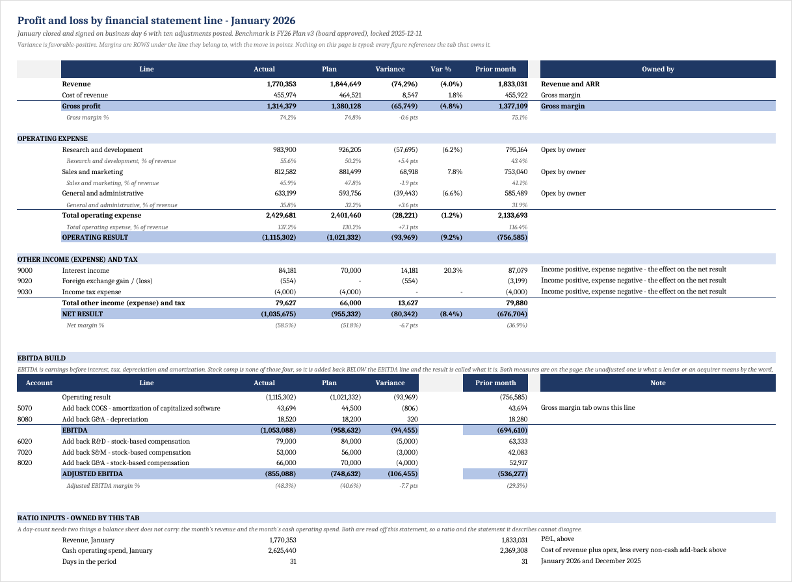
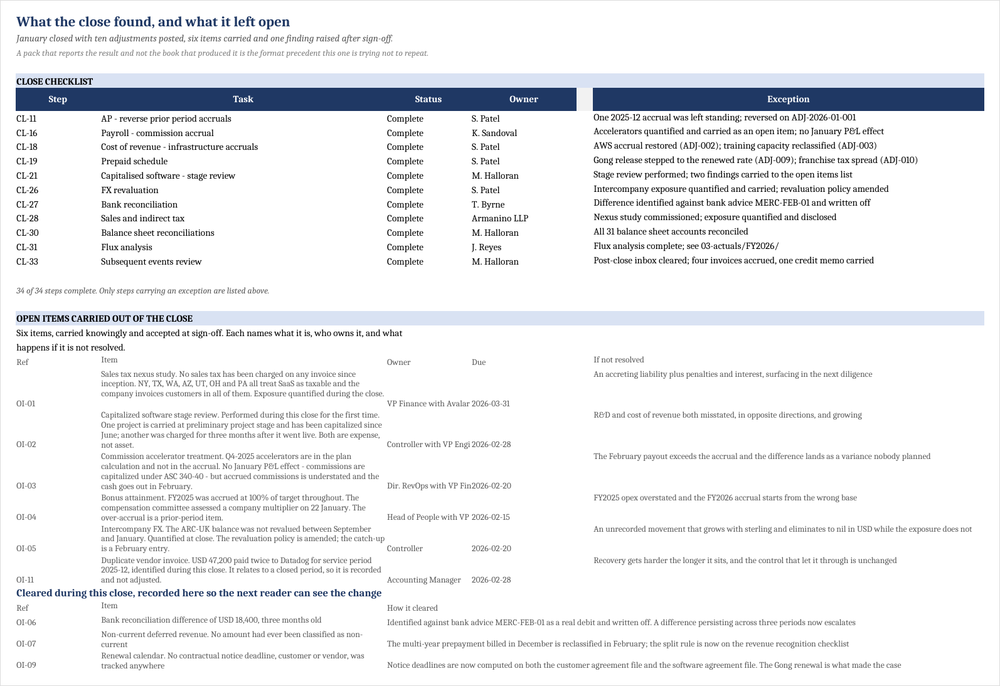

# An agentic finance function, built and run end to end

A working prototype of bookkeeping, month-end close, variance analysis, management reporting, and reforecast run by AI agents under a governance layer. Built as if it had to survive a skeptical founder, a CFO review, and a handoff to another operator.

The prototype was built and pressure-tested on a simulated B2B SaaS company using standard system exports rather than custom integrations.

> **The thesis:** the durable product is not another agent that can calculate. It is the judgment layer that prevents a finance function from silently changing definitions, inventing causes, or repeating corrected mistakes.

AI-native finance tools are good at ledger attribution — what moved, in which account, in which entity. They cannot tell you **why** in business terms, because the *why* isn't in the ledger. The value of a finance professional is still to see the story through the noise; this system is built to preserve that, not replace it.

## The 30-second proof

| What shipped | What makes it credible |
|---|---|
| End-to-end close, variance, reporting, and reforecast workflows | Every material output is tied to definitions, evidence, checks, and human approval |
| A nine-tab management pack with 455 formula cells | Derived values reference the tab that owns them rather than being retyped |
| A Q1 LBE with 275 formula cells | Assumptions and basis are separated from the monthly output |
| A correction that changed later agent behavior | The subsequent blind run cites the original review-ledger item and avoids the same error |
| A second synthetic-company test and a retained failure log | Portability and happy-path assumptions were tested rather than asserted |
| A deployment and commercialization path | The pilot has explicit entry criteria, pass gates, stop conditions, and production metrics |

## Start here

| If you are a… | Start with | The question it answers |
|---|---|---|
| Founder | [The product case](CASE-STUDY.md#for-a-founder-the-product-judgment) | Is there a sharp wedge, a defensible insight, and a credible next experiment? |
| CFO | [The control case](CASE-STUDY.md#for-a-cfo-the-control-judgment) and [executive brief](EXECUTIVE-BRIEF.md) | Would I trust a pilot, and what must be true before I do? |
| Recruiter or hiring manager | [The ownership case](CASE-STUDY.md#for-a-recruiter-the-ownership-signal) | What did the builder actually own across finance, product, systems, and execution? |
| Finance operator | [Management reporting pack](outputs/management-reporting-pack.md) | The output, exceptions, caveats, and decisions required |
| Controller or auditor | [Definitions](semantic-layer/definitions-instance.md), [rulings](semantic-layer/rulings/), and [red team](red-team/) | Traceability, refusal rules, known failures, and remediation |
| Product or engineering lead | [Architecture](architecture/blueprint.md), [live-instance spec](install/live-instance-spec.md), and [wiring](playbooks/wiring.md) | Where are the system boundary, tool surface, and deployment seams? |

## The output

The January management pack has nine tabs and 455 formula cells. Derived values reference the tab that owns them rather than being retyped into the presentation layer.



The exceptions tab is what turns a report into an operating process: ten adjustments posted, six items knowingly carried with an owner and due date, and three cleared items retained in the record.



Download the [January management pack](outputs/FY2026-01-management-pack.xlsx) and [Q1 latest best estimate](outputs/LBE_Q1_2026_M1.xlsx).

## Four claims, four exhibits

| Claim | Evidence | Read time |
|---|---|---:|
| Agents ran the close, variance analysis, reporting, and reforecast end to end | [Management reporting pack](outputs/management-reporting-pack.md) and [run log](runs/run-log.md) | 3 min |
| Every number is governed by a versioned definition, including contested items | [Definitions](semantic-layer/definitions-instance.md) and [rulings](semantic-layer/rulings/) | 3 min |
| Commentary has an explicit contract and accepted exemplars | [Commentary contract](contracts/commentary-contract.md) | 2 min |
| Human corrections persist into later behavior | [Loop verification](correction-loop/loop-verification.md) | 3 min |

### The most important exhibit

A human corrected an agent that had reported derived contract-expiry dates as observed facts. The correction became a versioned rule. In a later blind run, two independent agents applied the rule, cited the original review-ledger item, avoided all four false escalations, and still raised a genuine contradiction.

That is a demonstrated mechanism, not yet a demonstrated production track record. The distinction is intentional.

## How the control system works

```text
SOURCE EXPORTS
GL · billing · CRM · payroll · bank · contracts
                         │
                         ▼
DATA + JUDGMENT LAYER
preflight · definitions · rulings · evidence · playbooks
                         │
                         ▼
AGENT WORKFLOWS
Bookkeeper · Analyst · Reporter · Forecaster · Controller
                         │
                         ▼
CONTROLLED OUTPUT
checks · exceptions · approvals · review ledger · correction loop
```

Autonomy is earned per workflow, never granted to an agent as a whole. Promotion requires reviewed clean runs. A known failure mode or material correction triggers demotion. See the [agent playbook](playbooks/agent-playbook.md).

## Honest limits

- One simulated company; a second synthetic instance, Arcline, tests portability.
- One operator and self-grading.
- No real company’s books have run through the system.
- The correction mechanism is demonstrated once, not proven over a long operating history.
- Company-specific calibration—thresholds, voice, mappings, and accepted exemplars—does not transfer. The machinery does.
- The engine’s roughly 30 Python modules are not published, so this is an inspectable artifact, not a runnable product demo.

These are the next proof obligations, not footnotes. The [executive brief](EXECUTIVE-BRIEF.md) converts them into a gated real-company pilot.

## What broke

The failures are retained because each one changed the control design:

- **The agent improved the plan and corrupted the variance.** A methodologically better re-derivation flipped a sign. Plan values are now treated as inputs and protected by a hash gate. [Read the incident](what-broke/plan-hash-incident.md).
- **A compliant template erased judgment.** Ten of seventeen comments defaulted to “reforecast candidate,” while owner questions disappeared. Selection now comes from a playbook rather than agent preference. [Read the contract](contracts/commentary-contract.md).
- **A derived value was presented as observed.** Four computed expiries became false contradictions. Provenance now requires `basis: read` with a quote or `basis: derived` with the derivation. [Read the review](correction-loop/first-review-session.md).
- **The write-ups drifted from their workbooks.** After a rebuild, nearly every figure in the pack write-up's tables was stale — including a runway four months out, in the favorable direction — and two prose findings were simply wrong. A checker now asserts that every figure a write-up quotes still exists in the workbook it describes. [Read RUN 12](runs/run-log.md#run-12--the-write-ups-had-drifted-from-the-workbooks--1-sep).

The full, unedited record is in [`what-broke/`](what-broke/) and the [red-team audit](red-team/).

## Verified, in four layers

The claim is never that the numbers are right; it is that programs which did not build them say so.

1. [`verify_repository.py`](verify_repository.py) runs automatically on every change to this repository (GitHub Actions) and checks what is published here: checksums, workbook structure — 455 and 275 formula cells, no macros, no external links — and every internal link.
2. [`data/validate.py`](data/validate.py) is the tie-out suite the synthetic instance must pass before any agent touches it — 52 checks, including that the instance can name the generator build that produced it.
3. [`outputs/packverify.py`](outputs/packverify.py) recomputes every figure in the pack from the instance's data and asserts 42 cross-tab checks against the workbook's **recalculated** values, never its formulas.
4. [`outputs/docverify.py`](outputs/docverify.py) asserts that every figure a write-up quotes still exists in the workbook it describes — built after this repository's own drift incident (RUN 12), because the first three layers all passed while the prose was wrong.

Layers 2–4 read the live instance's data, so they don't run from this repository alone; they are published as evidence, with their results recorded in the [run log](runs/run-log.md).

## Install philosophy

The first deployment is read-only and sits on the existing finance stack. Agents produce the work from the first close; the human approves the output before it counts. Definitions are signed before production output, exceptions remain visible, and lower-touch review is earned from evidence.

The [install runbook](install/runbook.md) covers the 90-day sequence. The [organization assessment](install/org-assessment.md) separates mapping, export, system, and process gaps. The [portability report](install/portability.md) documents how a weak name-based check was replaced by an execution test—and the defects that test found.

## Repository map

| Folder | Contents |
|---|---|
| `architecture/` | System boundary, source/output design, workflow slicing, SaaS layer |
| `semantic-layer/` | Definitions, glossary, and human rulings |
| `contracts/` | Output and commentary acceptance criteria |
| `playbooks/` | Variance logic, agent promotion ladder, and wiring |
| `agents/` | Role charters and operating instructions |
| `correction-loop/` | Review ledger, two feedback loops, and verified learning behavior |
| `red-team/` | Audit brief, findings, and implementation response |
| `runs/` | Run logs, scorecards, ingestion sweeps, and the Arcline instance |
| `outputs/` | Packs, forecasts, long-range plan, workbooks, and independent checkers |
| `what-broke/` | Incidents, failure cases, and the unedited friction log |
| `data/` | Simulated-company design, methodology, edge cases, and tie-out checker |
| `install/` | Runbook, portability evidence, assessment, and model-routing policy |

## License

Documentation and example outputs are licensed under CC BY 4.0. Scripts are licensed under MIT. See [`LICENSE`](LICENSE).

Arcline AI and CourtIQ are synthetic. Every figure, customer, vendor, and employee is generated.

Built by Jonathan Ohana, 2026. The fastest way to improve this is to challenge a claim and follow its evidence.
